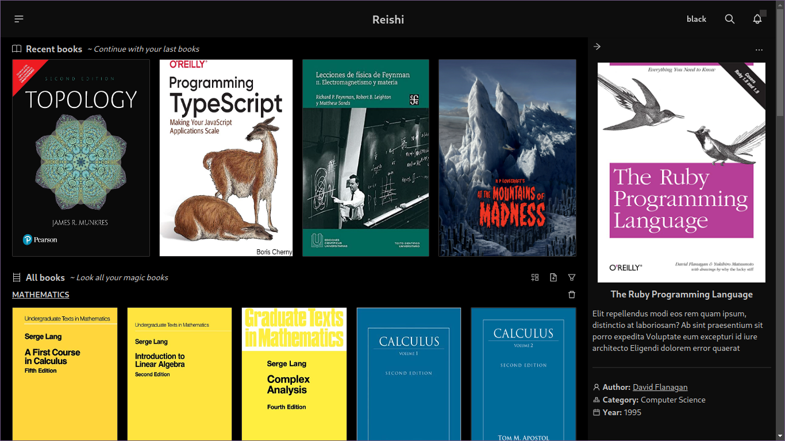

<p align="center">📖 Next Book Manager</p>

# Features 🚅
- Custom pdf viewer tool
- Multiple colorschemes
- Custom categories
- Manage book metadata
- etc...

### (Posible) Comming features
- Auto fetch book data
- Custom colorschemes
- Account features

# Compilation 👨‍💻
## Compile a release package
To compile for your plataform follow the next steps

```bash
npm run build
```
## Development mode
If you want to contribute or make some changes, follow the next steps

```bash
npm run dev
```
# TODOS 🤔
- [ ] reach a stable version.
- [ ] add notifications alerts.
- [ ] fetch book information from an API.
